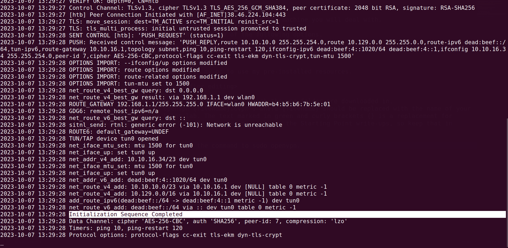

# Basics of penetration testing 

**In our journy to learn penetration we take a machines in HTB to can explain the basics of penetration** 

## meow machine  
 ** first step:**
  - this step will be your first thing you cheking out in any machine you will deal with.
  - To attack the target machine, you must be on the same network.
  - Connect to the Starting Point VPN using one of the following options.

  

  - I prefer to downloading the openvpn in my pc to use my pre-installed resources, in the next image you will see the commands for downloading.

  

  - As you see in this photo you will go to the folder which the vpn folder are downloaded in, then type this command `sudo openvpn {filename}.ovpn`, where `{filename}` should be replaced with the name of your
    `.ovpn` file for the Starting Point lab. 

  - The text marked in curly brackets {} is a replacement for your own version of input. This will be a recurring sight in the Starting Point write-ups, so keep that in mind!

           

  - when you run this command you will get the messege like this:

  

  - After making sure everything in the output is in order, you can open a new terminal tab or window. Leave the current one running; otherwise, you will lose the connection to the target, You are now ready to start.

  Now go to HTB window in chrome and you should have the green icon like this:
  

### Introduction: 

  first step as a real hacker,    
  - When first starting a penetration test or any security evaluation on a target, a primary step is known as
    Enumeration, This step consists of documenting the current state of the target to learn as much as
    possible about it.
  
  - Since you are now on the same Virtual Private Network (VPN) as the target, you can directly access it as any
    user would, If the target is a web server, running a public web page, you can navigate to its IP address to see
    what the page contains.

  - If the target is a storage server, you can connect to it using the same IP address to
    explore the files and folders stored on it, provided that you have the necessary credentials. The question is,
    **how do you find these services?** You cannot manually search for them because it would take a long time.
    Every server uses ports in order to serve data to other clients.

  - in the Enumeration phase involve scanning these open ports to see the purpose of the target on the network and what potential
    vulnerabilities might appear from the services running on it. In order to quickly scan for ports, we can use a
    tool called **nmap** , which we will detail more in the Enumeration chapter of this write-up.

  - After finding the open ports on the target, we can manually access each of them using different tools to find
    out if we have access to their contents or not. Different services will use different tools or scripts to be
    accessed. These can be discovered and learned by a beginner penetration tester only with time and practice
    (and some diligent Googling).**90%** of penetration testing consists of research done on the internet about the
    product you are testing. Since the technological ecosystem is continuously evolving, it is impossible to know everything about everything.

  - The key is to know how to look for the information you need, The ability to research effectively is the skill you need to continuously adapt and evolve into your top quality.
  
  - The objective here is not speed but meticulousness. If a resource on the target is missed during the Enumeration phase of your test, you might lose a vital attack vector which would have potentially cut your worktime on the target in half or even less.

  **Here i need you to be more relax we will start hacking right now.**

	If you ask yourself what do you have to start the attack , your answer will be "I have only the ip address for this machine" , and this is the good start for this low level machine .

### Enumeration"

  - After our VPN connection is successfully established, we can ping the target's IP address to see if our packets reach their destination. You can take the IP address of your current target from the Starting Point lab's page and paste it into your terminal after typing in the ping command as illustrated below.

  

  - After you take response , you will begin with the most comman enumeration tool which called "nmap" stands for Network Mapper,and it will send requests to the target's ports in hopes of receiving a reply, thus determining if the said port is open or not. Some ports are used by default by certain services.

  - Others might be non-standard, which is why we will be using the service detection flag -sV to determine the name and description of the identified services. The text marked in green and curly brackets {} is a replacement for your own version of input. In this case, you will need to replace the {target_IP} part with the IP address of your own target

  

  - As you see in nmap report you got some information about open ports and services that active in this port , in this nmap report you got port **23/tcp** open and have the service called **telnet**, what now??

  - I just need you to think as a haker , always remember if you have one information this mean you can know more and more informations , now go to **google** and search about port 23/tcp and search about telnet protocol.
 
  - After Googling we should know The Telnet, is developed in 1969, is a protocol that provides a command line interface for communication with a remote device or server, sometimes employed for remote management but also for initial device setup like network hardware. Since the target is running this service, it can receive telnet connection requests from other hosts in the network (such as ourselves). Usually, connection requests through telnet are configured with username/password combinations for increased security. We can see this is the case for our target, as we are met with a Hack The Box banner and a request from the target to authenticate ourselves before being allowed to proceed with remote management of the target host.

 #### Now we will try to get in the target from the open port:
  you should know how to use telnet because you made an google research before one step.
  here we will use telnet to take control the command is `telnet {target_ip}`

  

 - As you see you should have credentials to get in , we will search about the default credentials for telnet protocol	, Sometimes, due to configuration mistakes, some important accounts can be left with blank passwords for the sake of accessibility. This is a significant issue with some network devices or hosts, leaving them open to simple **brute-forcing attacks**, where the attacker can try logging in sequentially, using a list of usernames with **no password input**, the usernames maybe the next **admin, administrator, root**"

  

 The first two were not so lucky for us. When things look down, it is essential to keep going, be persistent. We can't succeed unless we attempt all possibilities. Let us try the last one.

  

 Success! We have logged into the target system. We can now go ahead and take a look around the directory we landed in using the ls command. There is a possibility we might find what we are looking for

  

  The **flag.txt** file is our target in this case. Most of Hack The Box's targets will have one of these files, which will contain a hash value called a flag . The naming convention for these targeted files varies from lab to lab. For example, weekly and retired machines will have two flags, namely `user.txt` and `root.txt`

  CTF targets and other labs will have `flag.txt` . Challenges will, most of the time, not contain an actual file, but rather offer you snippets of the flag as you solve it, the respective parts being embedded into the challenge more homogeneously (text hidden in an image, or other examples).

  You can read the file to have the hash value displayed in the terminal using the cat command. Copying the flag and pasting it into the Starting Point lab's page will grant you ownership of this machine, completing your very first task.

